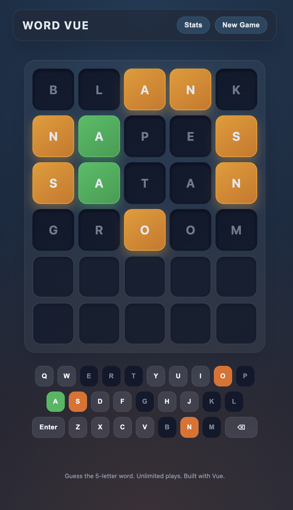

# Word Game

Word Game keeps your five-letter reflexes sharp. It’s a browser-native build with plain HTML, CSS, and JavaScript—fast load, clean interactions, ready whenever the urge to decode hits.



## Highlights

- Polished single-page flow with flip animations and full keyboard support
- Unlimited streaks—restart instantly without breaking your momentum
- Local stats do the bookkeeping (games played, win rate, streaks, distribution)
- Glassmorphism-inspired theme tuned for contrast and night-friendly play
- Validates every guess against a curated 14 k+ dictionary sourced from text files

## Prerequisites

- Node.js 18+ (for running a static dev server via `npx`)

## Run Locally

The app fetches dictionary files (`dict/*.txt`), so it expects HTTP/HTTPS. Spin up a lightweight static server from the project root:

```bash
# from repo root
npx serve .
# open the reported URL (default http://localhost:3000)
```

> You can install the server globally (`npm install -g serve`) if you prefer.

## Gameplay

- Type with your keyboard or tap the on-screen layout—both stay in sync
- `Enter` submits, `Backspace` deletes, no surprises
- Tile colors keep the logic transparent: green = exact spot, yellow = wrong spot, dark = not in the word
- Hit **New Game** whenever you want a clean slate

## Dictionaries & Customisation

Word lists live in the `dict/` folder:

- `dict/answers.txt` — words the game chooses from
- `dict/allowed.txt` — valid guesses (auto-merged with answers on load)

Both files ship with a comprehensive five-letter English dictionary (~14 855 entries). To swap in your own vocabulary:

1. Replace either/both files with your word lists (one 5-letter word per line; case-insensitive).
2. Refresh the browser — the app re-fetches the files on startup.

If the fetch fails (for example, the server blocks `.txt`), the app drops to a small built-in list and flags the issue with a toast.

## Statistics

- Stored in `localStorage` as `word-game:stats`
- Tracks games played, win rate, current/max streak, and guess distribution
- Clearing browser storage (or jumping into a private window) resets everything

## Project Layout

```
index.html   # single page entry point
style.css    # theme and layout
app.js       # game logic
dict/        # answer & guess dictionaries (text files)
```

## Good to Know

- Zero build chain—open in a browser after serving the folder
- Network access only touches the CDN script and local dictionary fetches
- Theme tokens live in `style.css` if you want to dial in your own palette

Happy guessing!
